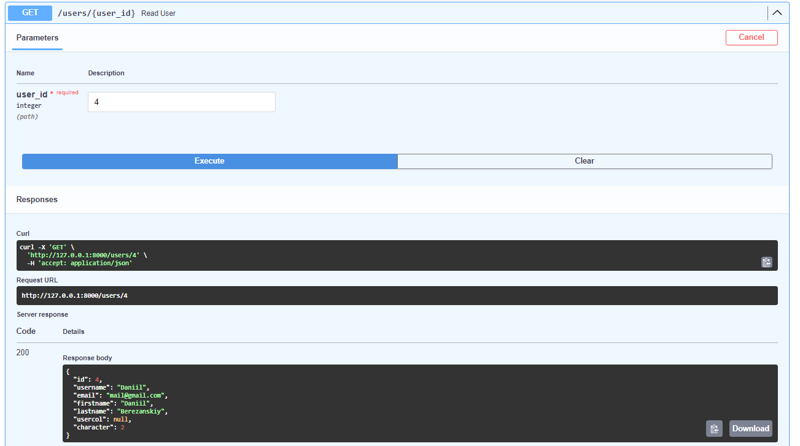

# Тестування працездатності системи ІО-24 Бережанський Данііл
## CRUD
[CRUD](https://highload.today/uk/shho-take-crud-prostimi-slovami-funktsiyi-perevagi-ta-prikladi/) — це акронім, джентельменський набір операцій для роботи з даними, і розшифровується він як:

Create (створювати);
Read (читати);
Update (оновлювати);
Delete (видаляти).
Розглянемо CRUD на прикладі користувача:
### Swagger Endpoints

### Create

### Read

### Update

### Delete

